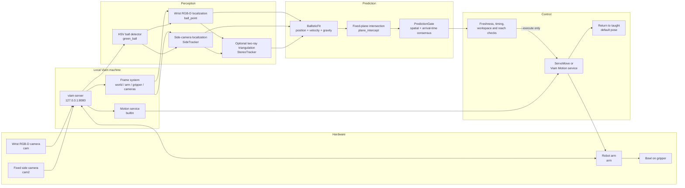
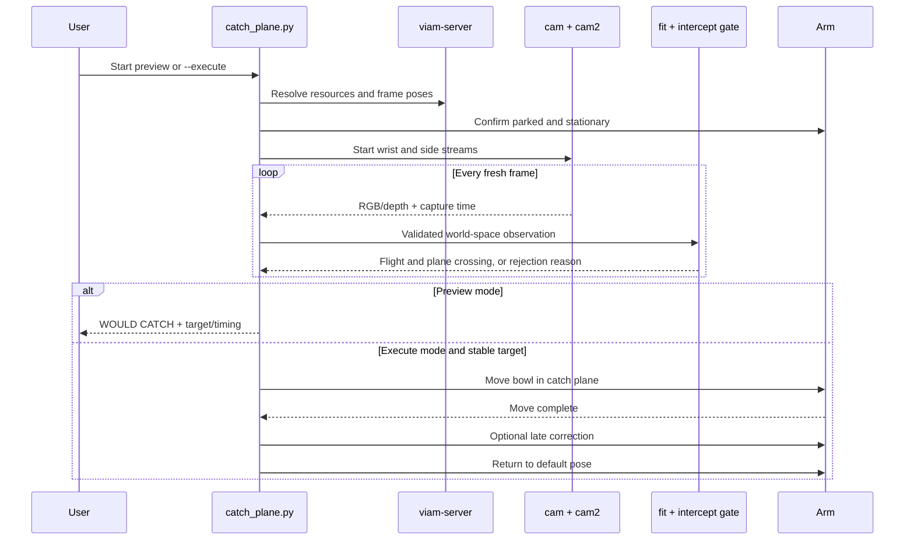

# Hackathon Catch

Hackathon Catch is a vision-guided robotic ball-catching system built with a
Viam-controlled arm, a wrist camera, and a fixed side camera. It detects a
lobbed ball, estimates its 3D trajectory, predicts where it will cross a fixed
catch plane, and moves a bowl into position for the catch.

This project was created for the **Viam Hackathon** and is a branched,
catch-focused version of
[`gracexu24/viamhackathon26`](https://github.com/gracexu24/viamhackathon26).
This repository isolates the complete catching workflow, its calibration data,
launch scripts, and hardware-independent tests.

The controller is safe by default: normal runs are preview-only and do not move
the robot. Physical movement must be explicitly enabled with `--execute`.

## Demo

<!-- Replace VIDEO_URL with the final YouTube, Vimeo, or Google Drive URL. -->

> **Video demo coming soon**
>
> The final demo will show camera tracking, trajectory prediction, the planned
> intercept, and the arm completing a catch.

<!-- Optional thumbnail once the video is ready:
[](VIDEO_URL)
-->

## System architecture

The main entry point is `motion.catch_plane`. It connects to the local
`viam-server`, reads both cameras concurrently, converts ball detections into
world-space observations, fits a trajectory, and owns the only path that can
command the arm.



### Runtime data flow

1. **Connect and validate.** The launcher reads Viam's cached machine
   configuration and connects to the local server. The controller resolves the
   arm, cameras, Motion service, and configured frames. It refuses to start an
   executing catch if another motion controller is active or the arm is already
   moving.
2. **Establish geometry.** The controller reads the parked flange, gripper, and
   wrist-camera transforms from Viam's frame system. The bowl-mouth position is
   the configured offset from the gripper frame. The catch plane is either a
   configured world-Z height or the bowl's parked height.
3. **Capture synchronized evidence.** The wrist loop reads RGB and, when
   enabled, aligned depth. `SideTracker` runs independently so a missed wrist
   detection does not erase a valid side-camera trajectory. Capture timestamps
   are checked for age before any observation enters a fit.
4. **Detect and localize the ball.** HSV segmentation finds ball-colored
   contours. Area, projected radius, temporal proximity, range, and throw-volume
   checks reject background objects. The wrist path can estimate distance from
   depth or apparent ball size; the fixed side path uses its calibrated pose and
   apparent size. Stereo mode intersects the two calibrated camera rays.
5. **Fit the flight.** `BallisticFit` models free flight in a Z-up world as
   `p(t) = p0 + v0*t + 0.5*g*t^2`, with gravity fixed at `-9810 mm/s²`. It fits
   position and velocity from recent observations and rejects large gaps,
   jumps, short time spans, and excessive residual error. A release-speed gate
   prevents held-ball samples from contaminating the flight fit.
6. **Predict the catch.** `plane_intercept` solves the quadratic for the
   descending crossing of the fixed catch height. The predicted bowl point is
   converted to a flange target using the measured bowl offset. Because height
   and wrist orientation stay fixed, the commanded correction is only in XY.
7. **Gate the prediction.** The target must be inside both the rectangular
   catch box and radial reach envelope. The measured arm timing model estimates
   whether the move can finish before the ball arrives. `PredictionGate`
   requires several predictions to agree in position and arrival time before a
   catch can be committed.
8. **Preview or execute.** Without `--execute`, the exact same pipeline prints
   `WOULD CATCH` and never sends a move. With `--execute`, the arm makes one
   short intercept move. The loop can apply one useful late nudge if fresh
   evidence still leaves enough time, then returns the robot to its taught
   default pose and rearms for a later throw.

### Why a fixed catch plane?

A general 3D interception problem must choose a height, position, orientation,
and time while the prediction is still changing. This project teaches the bowl
orientation once and holds its height constant. Catching then becomes a
two-axis translation plus one quadratic plane-crossing calculation. That makes
the target cheaper to compute, keeps the move short, and lets the measured arm
timing decide objectively whether a prediction is still actionable.

### Control sequence



### Coordinate frames and units

- All catch geometry uses millimetres and seconds.
- World Z points upward; gravity acts along negative Z.
- Camera pixels become camera rays through each camera's intrinsic parameters.
- Camera-to-world transforms come from Viam's frame system for the wrist camera
  and the validated PnP calibration for `cam2`.
- The bowl-mouth target is converted to a flange pose using
  `bowl_offset_gripper_mm`; reachability is checked on the flange target, not
  just on the ball position.
- Image capture time, rather than RPC completion time, is used for trajectory
  observations. Stale frames are rejected.

### Operating modes

| Mode | Command option | Behavior |
| --- | --- | --- |
| Preview | default | Runs perception and prediction; never commands motion |
| Fixed-plane catch | `--execute` | Commits a stable, reachable prediction and returns home |
| Wrist trajectory | `--trajectory-source wrist` | Uses wrist RGB-D/size localization for the flight fit |
| Side trajectory | `--trajectory-source side` | Uses the fixed calibrated camera; this is the default |
| Stereo trajectory | `--trajectory-source stereo` | Triangulates matching wrist and side-camera bearings |
| Planned movement | `--planned` | Sends the intercept through Viam Motion instead of direct short servo motion |
| Rough experiment | `--rough` | Loosens stability behavior for bounded continuous experiments; wrist source only |

## Hardware and services

- Viam-compatible robot arm (`arm`)
- Bowl or basket mounted to the end effector
- Wrist RGB-D camera (`cam`)
- Fixed side camera (`cam2`)
- Viam Motion service (`builtin`)
- Python 3.10 or newer

Resource names and physical limits are configured in
[`catch_plane.config.json`](catch_plane.config.json).

## Quick start

Install the Python dependencies:

```bash
python -m venv .venv
source .venv/bin/activate
python -m pip install -r requirements.txt
```

On the robot, the supplied launch script expects this repository at
`/opt/viam/trajectory-local` and uses the cached Viam machine configuration.

Start with a preview run. It tracks and predicts but does not move the arm:

```bash
cd /opt/viam/trajectory-local
./catch-plane.sh
```

After checking the camera feeds, calibration, workspace limits, default pose,
and emergency stop, enable the complete catch workflow:

```bash
cd /opt/viam/trajectory-local
./catch-plane.sh --execute
```

The process homes the arm, prints `READY`, waits for a valid throw, performs the
catch attempt, and returns to the default pose. Stop it at any time with
`Ctrl+C`.

Useful alternatives:

```bash
# Run for 30 seconds in preview mode
./catch-plane.sh --duration 30

# Use the wrist camera instead of the side camera as the trajectory source
./catch-plane.sh --trajectory-source wrist

# Run the separate catch-and-grip workflow in preview mode
./catch-throw.sh
```

## Configuration and calibration

The main runtime settings are in `catch_plane.config.json`. They are grouped by
the stage that consumes them:

| Area | Important settings | Used for |
| --- | --- | --- |
| Viam resources | `camera`, `arm`, `gripper`, `motion`, `world_frame` | Resolving hardware and coordinate frames |
| Ball detector | `hue_min/max`, `sat_min`, `val_min`, `min_area_px`, `min_radius_px` | Separating the ball from the image background |
| 3D localization | `ball_radius_mm`, `range_source`, `min/max_distance_mm` | Converting a pixel/radius or aligned depth into range |
| Flight fit | `min_samples`, `max_samples`, `max_gap_s`, `min_span_s`, `max_residual_mm` | Deciding when a trajectory is trustworthy |
| Catch geometry | `catch_plane_z_mm`, `bowl_offset_gripper_mm`, `bowl_axis_flange` | Mapping the ball crossing to the required flange pose |
| Workspace | `throw_volume_mm`, `catch_box_mm`, `min/max_reach_mm` | Rejecting impossible or unsafe observations and targets |
| Timing | `arm_latency_s`, `arm_speed_mm_s`, `arm_acceleration_mm_s2`, `arrival_margin_s` | Determining whether the arm can arrive in time |
| Stability | `stability_mm`, `stability_arrival_s`, `stability_samples`, `stability_span_s` | Requiring agreement across predictions before commit |
| Side camera | `side_calibration`, side HSV thresholds | Loading and validating the fixed-camera model |

Calibration helpers are included for the bowl and side camera:

```bash
./calibrate-bowl.sh
./calibrate-cam2.sh
./calibrate-cam2-pnp.sh
./measure-timing.sh
```

Calibration values are specific to the physical setup. Do not copy bounds,
offsets, or poses to another robot without measuring and validating them.

The side-camera calibration file records camera intrinsics, its world pose, and
quality information. Execution using the side or stereo source is blocked when
that calibration does not pass its quality checks. `measure-timing.sh` performs
real arm moves only when explicitly executed and fits the latency/acceleration
model used by the interception gate.

## Deployment model

The Python process runs on the same machine as `viam-server`. This avoids a
cloud round trip in the frame loop while still using Viam resources and the
machine's configured frame system.

```mermaid
flowchart TB
    DEV[Developer computer<br/>Git + Viam CLI]
    GH[GitHub<br/>hackathon_catch]
    subgraph ROBOT[Robot computer]
        REPO[/opt/viam/trajectory-local]
        VENV[/opt/viam/trajectory-local-venv]
        CFG[/root/.viam/cached_cloud_config_*.json]
        RUN[catch-plane.sh]
        SERVER[viam-server<br/>localhost:8080]
    end

    DEV <--> GH
    GH -->|git pull| REPO
    REPO --> RUN
    VENV --> RUN
    CFG --> RUN
    RUN --> SERVER
```

`catch-plane.sh` locates the cached machine configuration, selects the project
virtual environment, and starts `python -m motion.catch_plane`. Secrets remain
in Viam's cached configuration and are not stored in this repository.

## Tests

Run the headless test suite from the repository root:

```bash
python -m unittest discover -s tests -v
```

## Repository layout

The repository includes the current fixed-plane catcher as well as calibration
tools and earlier experiments that led to it.

### Primary catch path

| Path | Responsibility |
| --- | --- |
| `catch-plane.sh` | Robot-side launcher for the primary workflow |
| `catch_plane.config.json` | Physical setup, detector, fit, timing, and safety parameters |
| `motion/catch_plane.py` | Runtime orchestration, wrist localization, gating, movement, and homing |
| `motion/catch_side.py` | Independent `cam2` loop and side-calibration trust checks |
| `motion/ballistic.py` | Free-flight fit, fixed-plane crossing, timing, and reachability |
| `motion/stereo_tracking.py` | Capture-time pairing and triangulation of two camera rays |
| `motion/rolling_catch.py` | Prediction consensus and one-shot catch safety helpers |
| `motion/rough_cycle.py` | Per-throw rearming and optional rough-mode evidence handoff |
| `motion/live_camera_pose.py` | Viam pose conversion and capture-time pose interpolation |
| `motion/trajectory_local.py` | Local credentials, image decoding, and camera utilities |

### Calibration and diagnostics

| Path | Responsibility |
| --- | --- |
| `motion/calibrate_cam2_pnp.py` | Solves the fixed camera pose from pixel/world correspondences |
| `motion/calibrate_cam2.py` | Captures and solves ball-based side-camera calibration samples |
| `motion/calibrate_bowl.py` | Estimates the bowl-mouth offset from the gripper frame |
| `motion/handeye.py` | Eye-to-hand rigid-transform math and degeneracy checks |
| `motion/measure_timing.py` | Measures arm move latency, speed, and acceleration |
| `motion/red_probe.py` | Read-only live color-threshold diagnostic |
| `vision/live_ball.py` | Read-only RGB/depth visualization and annotation |
| `vision/viam_pipeline.py` | Lists and probes configured Viam vision resources |
| `calibration_data/` | Captured samples and fitted geometry retained for reproducibility |
| `cam2_catch_calibration.json` | Active fixed-side-camera calibration and quality metadata |

### Supporting workflows and experiments

| Path | Responsibility |
| --- | --- |
| `motion/catch_throw.py` | Alternative trajectory catch that can coordinate the gripper |
| `motion/rolling_preview.py` | Rolling-object/table-plane interception workflow |
| `motion/track_red.py` | Wrist-camera visual servoing toward a red target |
| `motion/viam_ball_catch.py` | Earlier Viam Vision-service ball-catching approach |
| `motion/viam_stationary_grab.py` | Stationary ball localization and pickup workflow |
| `motion/can_tracking.py`, `can_follower.py` | Red-can detection and following experiments |
| `motion/table_plane.py`, `rolling_intercept.py` | Table fitting and 2D rolling intercept geometry |
| `ball_tracking.py` | Reusable RGB/depth observation and simple trajectory primitives |
| `vision/viam_ball.py` | Read-only Viam detector/segmenter localization helpers |

These supporting workflows are not imported wholesale by the primary catcher;
they remain useful as diagnostics, calibration references, and documented
iterations of the system.

### Tests

The `tests/` directory mirrors the architecture. It covers detection,
ballistics, plane intersections, camera calibration, stereo geometry,
prediction stability, default-pose return, visual following, stationary pickup,
and mocked end-to-end control flow. Hardware calls are mocked so the suite can
run without moving a robot.

## Safety

Keep the robot workspace clear and maintain access to the emergency stop. Run
preview mode first, supervise every execution, and confirm that only one process
has control of the arm. The software checks timing, prediction quality, and
configured workspace limits, but those checks do not replace physical safety
validation.
