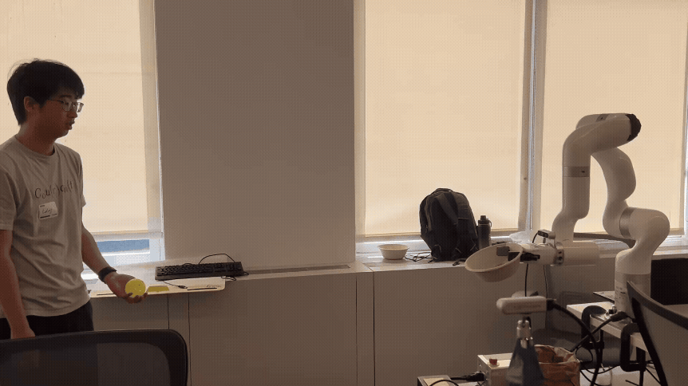

# Hackathon Catch

### 3rd Place - Viam Hackathon

We built a robot arm that can watch a ball being thrown, predict where it will
land, and move a bowl into place to catch it.

This project is a catch-focused branch of
[`viamhackathon26`](https://github.com/gracexu24/viamhackathon26), created for
the Viam Hackathon.

## The idea

Catching a ball sounds simple, but the robot has very little time to see the
throw, understand its path, and move to the right place. Instead of making the
arm chase the ball through the air, we keep the bowl at one fixed height and
predict where the ball will cross that height on its way down.

That turns a complicated 3D movement into a much faster two-direction move. The
arm only needs to slide the bowl forward, backward, left, or right while keeping
the same height and orientation.

## How we got the arm to catch the ball

We used two cameras connected through Viam:

- A fixed side camera watches the full throw and helps estimate when the ball
  will reach the catching height.
- A camera near the arm helps locate the ball and bowl in the robot's space.

The software looks for the bright ball in each camera frame and follows its
position over time. Those observations are converted into real-world positions
using our camera calibration. We then fit a simple flight path that includes
gravity, giving us an estimate of where the ball is going rather than only
where it is now.

Once the ball is moving downward, the program calculates where its path crosses
the height of the bowl. It waits until several predictions agree, checks that
the point is within the arm's safe reach, and makes sure there is still enough
time for the arm to move. If all of those checks pass, the bowl moves to the
predicted point for the catch.

After the attempt, the arm returns to its starting pose and gets ready for the
next throw.

## What made it work

- **Two camera views:** one view gives us the shape and timing of the throw,
  while the other connects it to the robot and bowl.
- **Camera calibration:** both camera views are mapped into the same coordinate
  system as the arm.
- **Trajectory prediction:** recent ball positions are used to estimate a
  curved path under gravity.
- **A fixed catch plane:** the arm makes a short, quick movement instead of
  trying to follow the ball in full 3D.
- **Real timing measurements:** the prediction is only used when the arm can
  physically reach the target before the ball arrives.
- **Safety checks:** unstable, stale, late, or unreachable predictions are
  rejected instead of being sent to the robot.

## Built with

- Viam for connecting the cameras, arm, motion service, and coordinate frames
- Python for the tracking and control loop
- OpenCV for finding the ball in each camera image
- NumPy for calibration, trajectory fitting, and interception math
- A UFACTORY UF850 arm with a bowl mounted at the end effector

## Main parts of the repository

- `motion/catch_plane.py` runs the complete catching workflow.
- `motion/ballistic.py` estimates the ball's flight and catch point.
- `motion/catch_side.py` handles the fixed side camera.
- `motion/stereo_tracking.py` combines observations from both cameras.
- `catch_plane.config.json` stores the camera, timing, workspace, and safety
  settings for the physical setup.
- `calibration_data/` contains the measurements used to align the cameras and
  robot.
- `tests/` checks the tracking, calibration, prediction, and control logic
  without moving real hardware.

The catch program starts in preview mode, so it can track and predict without
moving the arm. Robot movement only happens when execution is explicitly
enabled.
